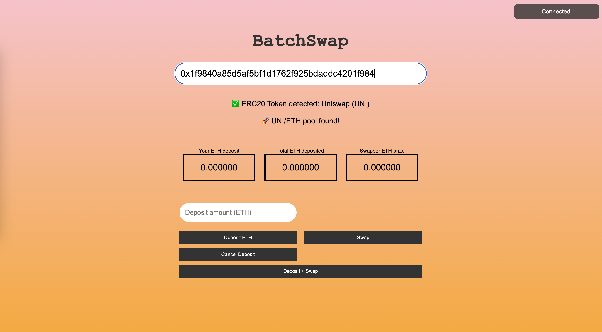

# BatchSwap

[batchswap.org](batchswap.org)

[https://miqlar.github.io/batchswap/web/](https://miqlar.github.io/batchswap/web/)



---

### Summary
A contract in which users can deposit ETH that gets batched and swapped for any token in UniswapV2. Benefit is saving gas in periods of high gas price, saving more than 50% of the swap cost, while the swapper gets a % of the value swapped as incentive to do so.


### Description
In periods in which mainnet is busy, with a lot of activity, gas prices increase a lot.

Swaps are one of the most common DeFi operations to perform, but in these periods, they become prohibitively expensive, only allowing whales to trade.

Batchswap is a solution to this - a uniswap wrapper that batches ETH deposits, which can be taken and swapped for the designated tokens by anyone. Why would someone do this? Because the swapper gets a % of the value swapped as a reward.

So, in numbers. Imagine 100 people want to swap in a high activity moment ETH for some popular token. They want to swap 100$ each, but swaps cost 30$ in gas. They deposit their 100$ in ETH in the batchswap contract, so now there is 10.000$ pooled (each paying 10-15$ in gas instead). Now, a swapper comes, as the prize is 1% of the value (so 100$). He pays 40$ to do the swap (because its more expensive to batchswap than to do a single swap due to the complexity), and obtains a profit of 60$.

The 100 users now how their tokens in the batchswap contract, which they can withdraw whenever they want (waiting for a period of less activity with lower gas prices, if prefered).


---

To run gas usage tests:
```
npx hardhat test-v2
```


Batchswap tests:
```
npx hardhat test-minimal-batchswap-v2
npx hardhat test-batchswap-v2
```


Useful addresses (Sepolia testnet):
```
UniswapV2Router02: 0xC532a74256D3Db42D0Bf7a0400fEFDbad7694008
Uniswap V2 Factory: 0x7e0987e5b3a30e3f2828572bb659a548460a3003
WETH9: 0x7b79995e5f793A07Bc00c21412e50Ecae098E7f9

ERC20 test token: 0xBb7fDACD5269083dE9e55322AD36A9eaECAAB44c
Batchswap contract: 0x020f52bbfD07C802a982BFf7B5626e77113eC2bb
```

## Run it Locally

A webserver needs to be spawned, because metamask does not work correctly if not.

```
python3 -m http.server 9000
```


